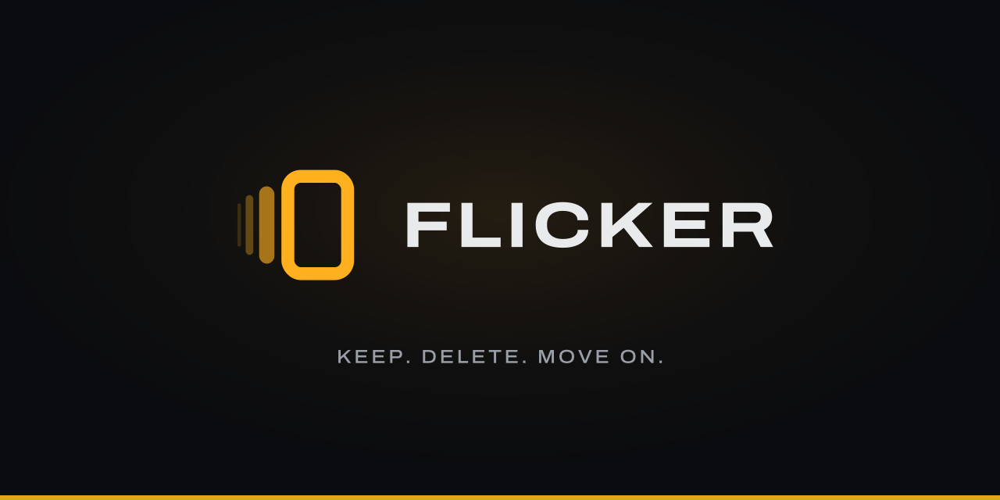
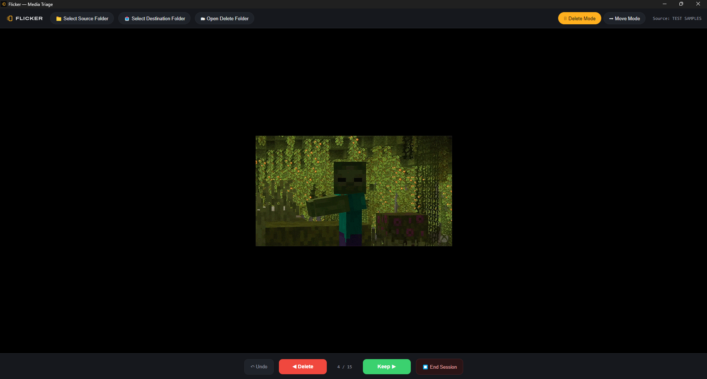
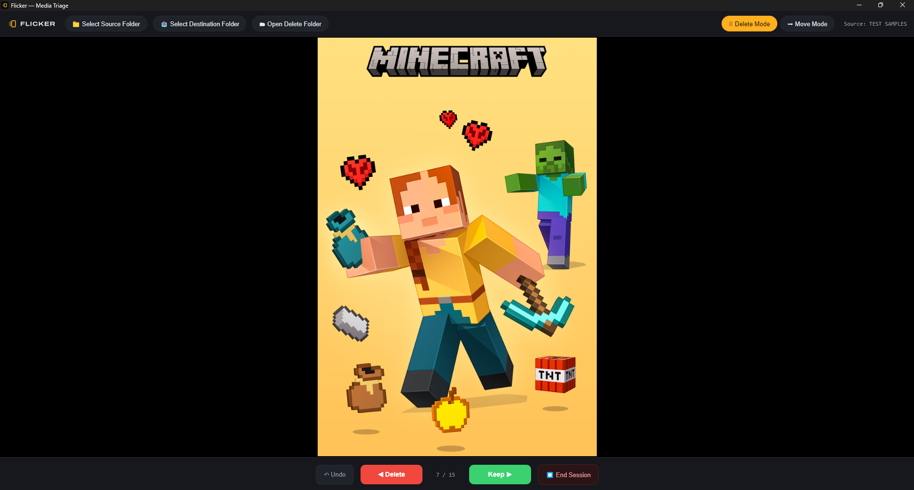
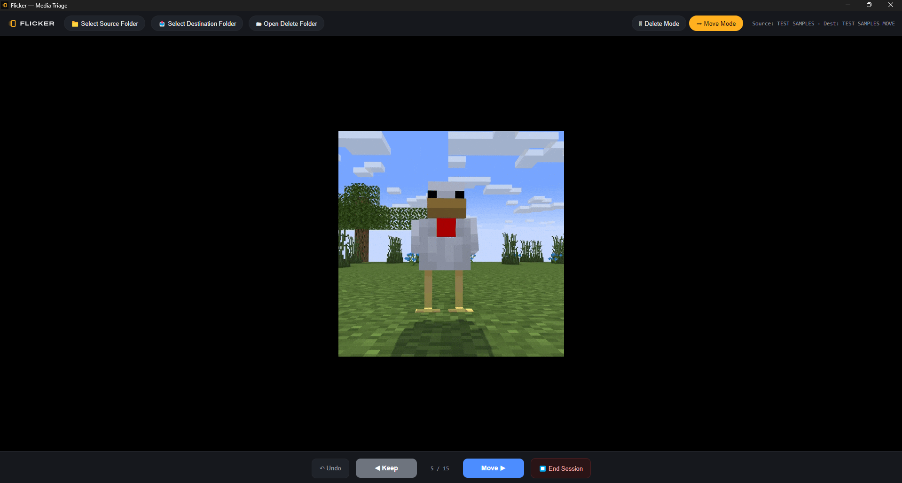
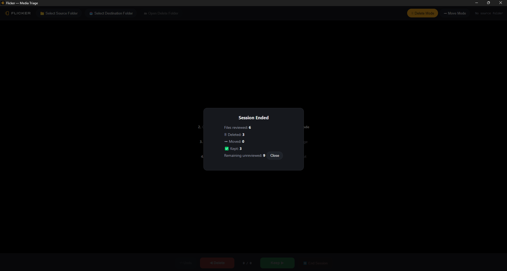

<p align="center">
  
</p>

# Flicker

**Keep. Delete. Move on.**

A local media triage app for Windows - a full-screen, swipe-style way to burn through a
folder of photos and videos and decide the fate of each one: keep, delete, or move.
Built with Electron, no cloud, no accounts, nothing leaves your machine.

<p align="center">
  <a href="https://github.com/nynglng/flicker/releases/latest">
    
  </a>
</p>

<p align="center">
  
</p>

## Demo

| Delete Mode | Move Mode |
|---|---|
|  |  |

## Why

Camera rolls and download folders accumulate thousands of near-duplicate photos and
screenshots. Flicker turns cleanup into a single-file-at-a-time flow: one file fills the
screen, you make one decision, the next file appears. Arrow keys, on-screen buttons, or a
swipe - whatever's fastest.

## Features

- **Delete Mode** - left = delete, right = keep. Deleted files move to a `_deleted`
  subfolder inside the source (never permanently gone).
- **Move Mode** - left = keep, right = move to a chosen destination folder.
- **Undo** - reverse the last action at any point.
- **Session summary** - a quick tally of what was kept, moved, and deleted when you end a
  session.
- Handles both images (jpg, png, gif, webp, bmp, svg, avif, heic) and videos (mp4, webm,
  mov, m4v, mkv, avi, ogg), with proper video seeking via range-request streaming.

<p align="center">
  
  
</p>
<p align="center">
  
</p>

## Download

Grab the latest build from [Releases](https://github.com/nynglng/flicker/releases/latest):

- **`Flicker-Setup-x.x.x.exe`** — installer, adds Start Menu/Desktop shortcuts and an
  uninstaller entry.
- **`Flicker x.x.x.exe`** — portable, no install, just run it.

Both are unsigned, so Windows SmartScreen may flag them on first run; click
**More info → Run anyway**.

## Releases

`.github/workflows/build-and-sign.yml` builds the portable exe and the installer on any
pushed `v*` tag and attaches them to the GitHub Release.

Code signing is wired up through [SignPath.io](https://signpath.io) but not yet active —
its GitHub Actions connector requires a Trusted Build System, which is only available on
the SignPath Foundation open-source plan (application pending). Once approved, setting the
repository variable `SIGNPATH_ENABLED` to `true` switches the signing step on and the
release gets signed binaries instead.

## Running from source

```bash
npm install
npm start
```

## Building a Windows executable

```bash
npm run dist
```

Produces a portable, single-file `.exe` in `dist/` - no installer, just run it.

## Tech

Electron main process owns the filesystem (folder picking, file moves/deletes, and a
custom `flicker-media://` protocol for streaming media with `Range` support). The
renderer is a single static HTML/CSS/JS file with no framework and no build step. IPC
between them is scoped to four calls exposed through a `contextBridge` preload, with
`contextIsolation` and `sandbox` on.

## License

ISC
